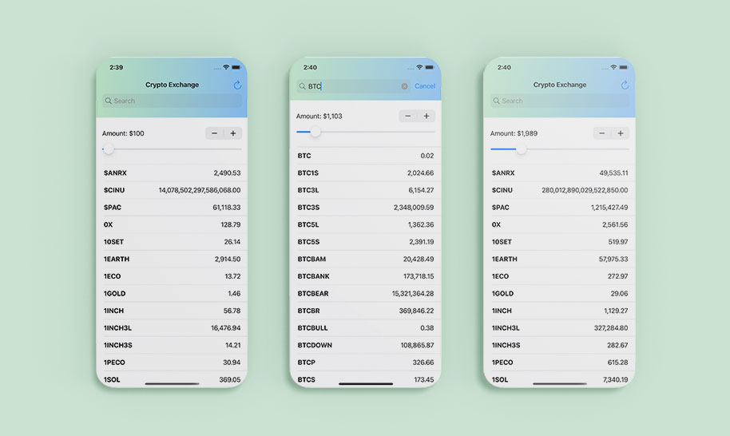
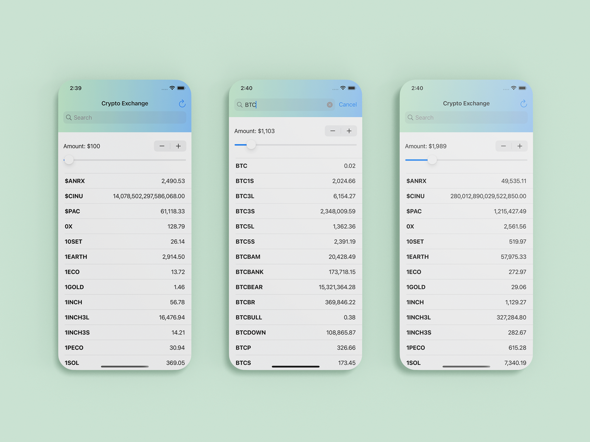

# Crypto Exchange Rates

Crypto Exchange Rates Checker iOS app concept using SwiftUI 3.0 and CoinAPI.io 🥳
Get accurate and reliable Cryptocurrency exchange rates, based on CoinAPI.io


[](https://opensource.org/licenses/Apache-2.0)
[](https://github.com/shameemreza/CryptoExchange/blob/main/LICENSE)


## Video Preview

[](https://youtu.be/Rf6eAb0kc9I "Crypto Exchange Rates")

## Screenshots




## Features

* Clean Design
* SwiftUI MVVM Architecture
* API Integration
* SwiftUI for iOS 15


Dribble Shot 👉 [Click Here](https://dribbble.com/shots/17896761-Crypto-Exchange-Rates-Checker-App-UI)

## License

```
Copyright 2022 Shameem Reza

Licensed under the Apache License, Version 2.0 (the "License");
you may not use this file except in compliance with the License.
You may obtain a copy of the License at

   http://www.apache.org/licenses/LICENSE-2.0

Unless required by applicable law or agreed to in writing, software
distributed under the License is distributed on an "AS IS" BASIS,
WITHOUT WARRANTIES OR CONDITIONS OF ANY KIND, either express or implied.
See the License for the specific language governing permissions and
limitations under the License.
```
